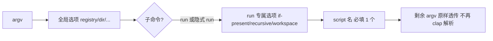
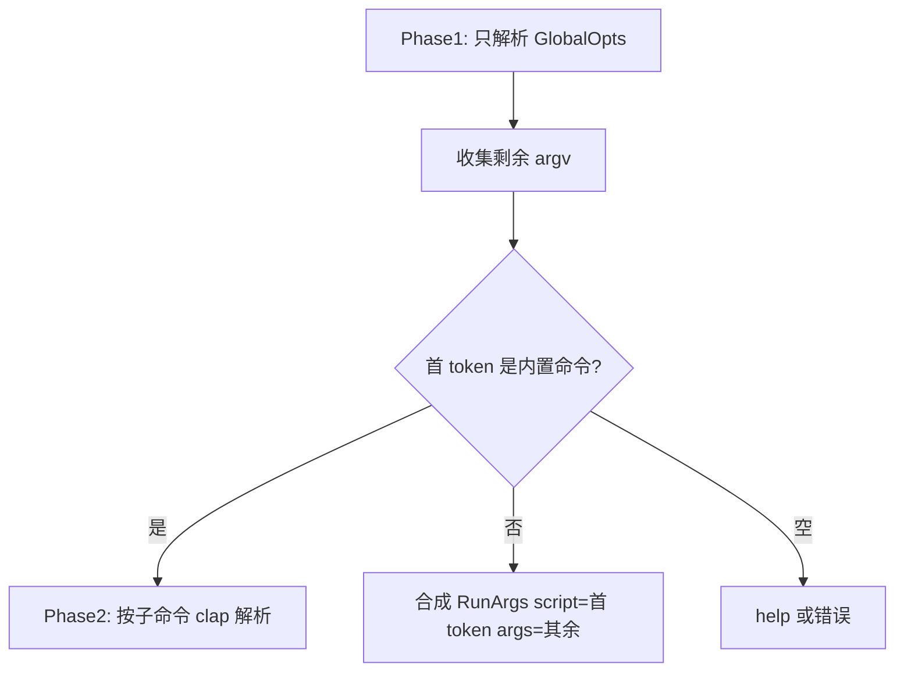
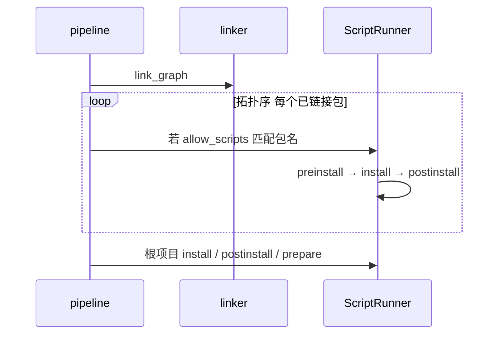

# CLI 参数透传、隐式 run 与 lifecycle 脚本设计

## 概述

本文档描述三项 CLI / 安装管道增强的设计方案：

1. **参数透传**：向 rollup 等子进程传参时不必使用 `--` 分隔（`oi run build -w` 而非 `oi run build -- -w`）。
2. **隐式 `run`**：未匹配内置子命令时默认执行 `run`（`oi dev` ≡ `oi run dev`）。
3. **`postinstall` 未生效**：区分项目级与依赖级脚本，补齐实现缺口并修正错误处理与阶段顺序。

相关文档：

- [CLI & Config](./cli-config.md)
- [Lifecycle Scripts](./lifecycle-scripts.md)
- [安装管道](./core.md)

---

## 现状速览

| 能力 | 设计文档 | 当前实现 |
|------|----------|----------|
| `orix run` + 参数透传 | 有 | 有 `trailing_var_arg`，但缺 `allow_hyphen_values`，`-a` 等常被 clap 当成 CLI 选项 |
| 隐式 `run`（`oi dev`） | 有 | 已实现（`external_subcommand`） |
| 根项目 `postinstall` | 有 | 已实现：失败阻断 install；`prepare` 有脚本即执行；完成日志在 lifecycle 之后 |
| 依赖包 `postinstall` | 有 + `allow-scripts` | 已实现：`run_dependency_lifecycles` + 拓扑顺序 |

---

## 1. 参数透传：去掉强制的 `--`

### 目标

```bash
# 期望
oi run build -w --config rollup.config.mjs
oi build -a 2                    # 隐式 run 时同样

# 而不是
oi run build -- -w --config rollup.config.mjs
```

与 [pnpm `run`](https://pnpm.io/cli/run) 一致：**脚本名之后的参数全部交给脚本**，不再要求 `--` 分隔（`--` 仅在与 pnpm/orix 自身选项冲突时保留兼容）。

### 解析规则



约定：

1. **orix 选项必须在脚本名之前**  
   - `oi run --recursive --if-present test` ✅  
   - `oi run test --recursive` ❌（`--recursive` 会进脚本）

2. **脚本名之后**：`allow_hyphen_values = true` + `trailing_var_arg = true`，停止 clap 解析。

3. **兼容旧写法**：若透传参数以字面量 `--` 开头，执行前剥掉一层（npm 用户习惯保留）。

```rust
fn normalize_script_args(args: Vec<String>) -> Vec<String> {
    if args.first().is_some_and(|s| s == "--") {
        args[1..].to_vec()
    } else {
        args
    }
}
```

### CLI 改动（`RunArgs`）

```rust
#[derive(Args)]
struct RunArgs {
    script: String,

    /// 脚本名之后的参数；支持以 `-` 开头的 flag。
    #[arg(trailing_var_arg = true, allow_hyphen_values = true)]
    args: Vec<String>,

    // run 专属 flag 保持 long/short，且排在 script 之前（clap 默认 positional 在最后）
    #[arg(long)]
    if_present: bool,
    // ...
}
```

在 `crates/core/src/script.rs` 的 `run_single` 里，对 `args` 先 `normalize_script_args` 再拼进 shell 命令（现有 `shell_args_join` 逻辑可复用）。

### 文档更新

更新 [cli-config.md](./cli-config.md) 与 [lifecycle-scripts.md](./lifecycle-scripts.md)：

- 示例改为 `orix run dev --host 0.0.0.0`（无 `--`）
- 注明：与 pnpm 对齐；npm 仍常用 `--`，orix 两种都支持

### 测试

| 用例 | 断言 |
|------|------|
| `orix run echo-script -a 2` | 子进程收到 `-a`、`2` |
| `orix run echo-script -- -a 2` | 同上（剥 `--`） |
| `orix run build --if-present -x` | `-x` 给脚本，不是 orix 选项 |

---

## 2. 隐式 `run`：`oi dev` ≡ `oi run dev`

### 目标

与 pnpm 一致：第一个非全局、非内置 token 若不是子命令，则当作 **script 名**，其余走 `run` 透传。

```bash
oi dev
oi dev --host 0.0.0.0
oi run dev          # 显式仍保留
```

### 内置命令表（需完整、含 alias）

```txt
install, i
add, a          # 若将来加 alias
remove, rm
run
store (+ path|prune|verify)
cache (+ path|clean)
import, export, deploy
--version, --help
```

**冲突策略**（与 pnpm 相同，接受边缘情况）：

- 若项目里真有名为 `add` 的 script，需用 `oi run add`。
- `run` 专属选项（`--recursive`、`--workspace`、`--if-present`）**不能**用在隐式形式；必须 `oi run --recursive build`。

### 解析架构：两阶段

`subcommand_required(false)` 单独不够，建议 **自定义入口解析**：



实现草图：

```rust
const BUILTIN_COMMANDS: &[&str] = &[
    "install", "i", "add", "remove", "run",
    "store", "cache", "import", "export", "deploy",
    // store/cache 子命令在 phase2 处理
];

fn parse_cli(argv: impl Iterator<Item = OsString>) -> ParsedCli {
    let (globals, rest) = GlobalOpts::parse_partial(argv)?;
    let (cmd_token, tail) = split_first_positional(&rest);
    match cmd_token {
        Some(t) if BUILTIN_COMMANDS.contains(&t.as_str()) => {
            parse_builtin_subcommand(t, globals, tail)
        }
        Some(script) => ParsedCli::Run(globals, RunArgs { script, args: tail, ..default() }),
        None => ParsedCli::HelpOrError,
    }
}
```

`crates/cli/src/main.rs` 的 `match cli.command` 改为 `match parse_cli(...)`。

### `oi` 别名

二进制名 `orix`，用户用 `oi` 需在安装时提供 symlink/拷贝，或文档写 `cargo install --bin orix` + shell alias；**解析逻辑与二进制名无关**。

### 测试

- `oi dev` 执行 `scripts.dev`
- `oi install` 仍走 install
- `oi -C subpkg test`：全局 `-C` + 隐式 `run test`
- `oi unknown-cmd` → 提示「无此 script」而非「无此子命令」

---

## 3. `postinstall`「没生效」：根因与设计修复

先区分用户说的两种「postinstall」：

| 类型 | 定义位置 | 当前行为 | 用户常见预期 |
|------|----------|----------|--------------|
| **项目** | 根 `package.json` | link 后、写 lockfile 后会调 `run_project_lifecycle(Postinstall)` | 安装结束前应跑完且失败应报错 |
| **依赖** | 各依赖的 `package.json` | **未实现**；仅有 `allow_scripts` 配置 | `esbuild`、`sharp` 等安装后要跑 postinstall |

### 3.1 项目级 postinstall：已有调用，但有三个缺陷

#### ① 脚本失败不失败 install

`crates/core/src/pipeline.rs` 中 `run_project_lifecycle` 在 `ScriptError::Failed` 时只发送 reporter 事件，**从不 `bail!`**，与 `orix run` 行为不一致。

**设计**：非零退出码必须使 `install` 返回 `Err`。

#### ② 日志顺序误导

当前 `info!("install complete")` 在 **postinstall 之前** 打出，UI 上像「装完了但脚本没跑」。

**设计**：顺序调整为：

```txt
link
→ project install（根 scripts.install）
→ write lockfile
→ project postinstall
→ project prepare（策略见下）
→ layout 最终校验
→ "install complete" + Finished 事件
```

#### ③ `prepare` 仅在「无旧 lockfile」时跑

当前仅 `old_lockfile.is_none()` 时执行 `prepare`。npm/pnpm 在每次 `install` 时若存在 `prepare` 都会执行（git 依赖场景尤甚）。

**设计**：**只要 manifest 有 `prepare` 就执行**（仍受 `--ignore-scripts` 控制）。

### 3.2 依赖级 postinstall：主要缺口

`dependency_scripts_allowed` 只在 `crates/core/src/script.rs` 单元测试中出现，**install pipeline 从未遍历依赖执行 lifecycle**。若用户期望的是 `esbuild`、`sharp` 等依赖的安装脚本，在未实现本节前 **不会生效**；仅配置 `allow-scripts[]` 也不够。

设计新增阶段（在 link 之后、根 lifecycle 按 npm 顺序穿插）：



规则（延续 [lifecycle-scripts.md](./lifecycle-scripts.md)）：

| 配置 | 行为 |
|------|------|
| 默认 | 依赖 lifecycle **关闭** |
| `.npmrc` `allow-scripts[]=esbuild` | 仅列名包执行 |
| `ORIX_ENABLE_SCRIPTS=true` | CI 可全开（可选，后续增强） |
| `--ignore-scripts` | 项目 + 依赖全跳过 |

实现要点：

- 从 lockfile / graph 取 `(name, version, store_path 或 .pnpm 实体路径)`
- 读该包 `package.json`（store 内或 link 目标）
- `ScriptRunner` 需支持 **非根 cwd**（`project_root` → `package_dir`）
- Reporter：`InstallPhase::Scripts` 显示 `postinstall esbuild@0.21.5`

### 3.3 排查清单（自助诊断）

1. `.npmrc` 是否 `ignore-scripts=true`
2. 是否 `oi install --ignore-scripts`
3. 期望的是 **依赖** postinstall → 需 `allow-scripts[]=包名` + 实现 3.2 节
4. 是否 workspace 子包脚本（只跑根 manifest 时子包不会跑）
5. 开 `ORIX_DEBUG=1` 看 `script.rs` 的 `running script` trace

### 3.4 实施顺序建议

| 优先级 | 内容 | 关联需求 |
|--------|------|----------|
| P0 快修 | `allow_hyphen_values` + 剥 `--` | §1 参数透传 |
| P0 快修 | `run_project_lifecycle` 失败即 `bail` + 调整日志/阶段顺序 | §3 项目级 |
| P1 中 | 隐式 `run` 两阶段解析 | §2 |
| P2 大 | 依赖 lifecycle 拓扑执行 + `allow-scripts` | §3 依赖级 |

---

## 文档与代码变更汇总

| 文件 | 变更 |
|------|------|
| `docs/.project/design/cli-config.md` | 隐式 run、无 `--` 透传示例 |
| `docs/.project/design/lifecycle-scripts.md` | 依赖 lifecycle 阶段、失败策略、prepare 策略 |
| `docs/.project/design/index.md` | 增加本文档索引条目 |
| `crates/cli/src/main.rs` | 两阶段解析 / `RunArgs` |
| `crates/core/src/pipeline.rs` | 阶段顺序、错误传播、依赖 scripts |
| `crates/core/src/script.rs` | 多包 cwd、`normalize_script_args` |

---

## 待确认

实现前建议确认 **postinstall 未生效** 的具体场景：

1. **根目录** `package.json` 里的 `postinstall`（例如 monorepo 根脚本）  
2. **某个依赖** 的安装脚本（例如 `esbuild`、`@parcel/watcher`）

- 若是 **1**：优先 P0 项目级修复（失败报错 + 阶段顺序）。  
- 若是 **2**：必须完成 §3.2 依赖 lifecycle；在此之前 `allow-scripts` 配置 alone 无效。

---

## 修订记录

| 日期 | 说明 |
|------|------|
| 2026-05-20 | 初稿：参数透传、隐式 run、postinstall 根因与实施顺序 |
