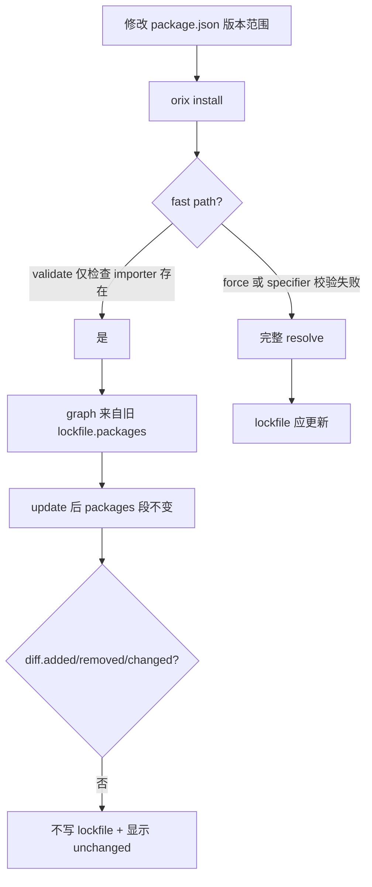

# Issue 002：package.json 升级依赖版本后 lockfile 无变化

**状态**：已修复（2026-05）  
**相关代码**：`crates/core/src/pipeline.rs`、`crates/lockfile/src/lib.rs`

## 已落地修复

| 项 | 实现 |
| --- | --- |
| 快路径条件 | `validate_frozen` 替代弱 `validate`；specifier 变更时打日志并走完整 resolve |
| `lockfile_changed` | `Lockfile::diff_has_changes` 包含 `importers_changed`（快路径 + 主路径） |
| 测试 | `diff_has_changes_true_for_importers_only`、`validate_frozen_rejects_specifier_change_disables_fast_path` |

---

## 现象

- 在 `package.json` 中把某依赖版本范围调高（例如 `^1.0.0` → `^2.0.0`），或期望解析到更新的 minor/patch。
- 执行 `orix install` 后 **`orix-lock.yaml` 内容不变**（或仅时间戳/无关字段不变），`packages` 里仍是旧版本 key（如 `/foo@1.2.3`）。
- CLI 可能显示 `Lockfile unchanged`。

---

## 结论（根因）

这是**设计/实现组合问题**，不是 YAML 写入失败。常见触发路径有两条。

### 根因 A：Lockfile 快路径跳过 registry 解析（主因）

当满足以下条件时，install 走 **fast path**，**不会**调用 `Resolver`：

- 存在 `orix-lock.yaml`；
- 未使用 `--force`、`--frozen-lockfile`；
- `Lockfile::validate(&manifest, ".")` 返回 `Ok`。

而 `validate` **几乎不比较** `package.json` 与 lockfile 的 specifier，只检查 importer 是否存在：

```484:504:crates/lockfile/src/lib.rs
    pub fn validate(
        &self,
        _manifest: &Manifest,
        importer_id: &str,
    ) -> anyhow::Result<()> {
        // ...
        if let Some(importer) = self.importers.get(importer_id) {
            // Specifier mismatches are fine — we'll diff and report them.
            let _ = importer;
            Ok(())
        } else {
            anyhow::bail!("Lockfile is missing importer '{}'", importer_id);
        }
    }
```

快路径直接从 lockfile 重建 graph：

```454:456:crates/core/src/pipeline.rs
            if lf.validate(&manifest, ".").is_ok() {
                debug!(target: "orix", "FAST PATH triggered");
                let graph = resolve_from_lockfile_packages(&lf.packages);
```

**结论**：只要 lockfile 文件存在且格式合法，即使用户已修改 `package.json` 版本范围，仍会**沿用 lockfile 里已锁定的解析结果**，不会向 registry 重新 resolve 新版本。

对比：`validate_frozen` 会严格比对 specifier（用于 CI `--frozen-lockfile`），但**普通 install 不用它**。

---

### 根因 B：快路径下 `importers_changed` 未触发写盘

快路径末尾仅在 `diff.added / removed / changed` 非空时才写入 lockfile：

```667:669:crates/core/src/pipeline.rs
                let lockfile_changed =
                    !diff.added.is_empty() || !diff.removed.is_empty() || !diff.changed.is_empty();
```

`Lockfile::diff` 会计算 `importers_changed`（specifier 变更），但**未纳入** `lockfile_changed`：

```408:434:crates/lockfile/src/lib.rs
        let mut importers_changed: Vec<_> = old
            .importers
            .keys()
            // ... 比较 importer.specifiers ...
```

因此即使用 `update()` 生成了「 specifier 已更新、packages 仍为旧图」的新 lockfile，只要 `packages` 段 key 不变，快路径会**跳过 `write()`**，磁盘上的 lockfile **完全不变**。

---

### 根因 C：正常路径的「未变化」判定与全量写入语义不一致（次要）

非快路径下**每次**都会 `updated_lockfile.write(...)`，但日志/状态用 `lockfile_changed` 时**同样忽略 `importers_changed`**：

```1118:1119:crates/core/src/pipeline.rs
        lockfile_changed =
            !diff.added.is_empty() || !diff.removed.is_empty() || !diff.changed.is_empty();
```

用户若只看「Lockfile unchanged」或 diff 报告，会误以为未写入；若仍看不到版本变化，说明实际走了**快路径（根因 A）**，graph 本身未更新。

---

### 根因 D：`update()` 按包名匹配 graph，无法表达「同名多版本」

importer 解析直接依赖写入 lockfile 的 graph：

```225:226:crates/lockfile/src/lib.rs
        for (name, raw) in &manifest.dependencies {
            if let Some(pkg) = graph.packages().find(|p| p.id.name.as_str() == name) {
```

`find` 只按 **name** 取第一个包。若 graph 未重新 resolve，永远落到 lockfile 里的旧 `name@version`。

---

## 因果链（用户视角）



---

## 如何验证

1. 修改 `package.json` 某 direct dep 的 semver 范围，执行 `orix install`，观察日志是否出现 `resolved from lockfile (fast path)`。  
2. 对比 `importers..specifiers` 与 `packages` 中对应版本是否不一致。  
3. 使用 `orix install --force`：若 lockfile 随后更新，可确认是快路径未 re-resolve。

---

## 修复方案

### P0（行为正确性）

1. **收紧快路径触发条件**  
   - 将 `lf.validate(&manifest, ".")` 改为与 `validate_frozen` 同级或新增 `validate_specifiers_match`：  
     - 比较 `manifest.dependencies/devDependencies/optionalDependencies` 与 lockfile `importers.*.specifiers`（及已锁版本是否仍满足 range，可选）。  
   - **任一 specifier 变化 → 禁止 fast path，必须走 Resolver。**

2. **`lockfile_changed` 纳入 `importers_changed`**  
   ```rust
   let lockfile_changed = !diff.added.is_empty()
       || !diff.removed.is_empty()
       || !diff.changed.is_empty()
       || !diff.importers_changed.is_empty();
   ```  
   - 快路径与慢路径统一；specifier 变更时写盘并打 `lockfile updated`。

3. **快路径写盘策略**  
   - 与慢路径一致：只要 `update()` 结果与磁盘不同就 `write`（可用完整 diff 或序列化 hash），避免「内存已更新、磁盘未变」。

### P1（pnpm 对齐）

4. **`orix update` / `orix install --latest`（可选）**  
   - 显式命令：在 specifier 范围内重新 resolve 并刷新 lockfile，文档说明与 `npm update` 差异。

5. **提示信息**  
   - 检测到 specifier 变更但走完整 resolve 时：`lockfile out of date for package.json, re-resolving...`  
   - 避免用户误以为 install 会「自动升到最新」。

### P2（测试）

6. **回归测试**（`crates/lockfile` / `tests/integration`）  
   - fixture：`package.json` 从 `^1.0.0` 改为 `^2.0.0`，mock registry 返回 2.x。  
   - 断言：非 fast path、`packages` 出现新 key、`importers` specifier 更新。  
   - 断言：`importers_changed` 单独即可触发 `lockfile_changed`。

---

## 临时规避（用户侧）

| 目标 | 做法 |
| --- | --- |
| 强制按新版本 resolve | `orix install --force` |
| CI 严格一致 | `orix install --frozen-lockfile`（specifier 不匹配会直接失败） |
| 手动刷新锁文件 | 删除 `orix-lock.yaml` 后重新 `orix install`（会全量 resolve） |

---

## 验收标准

- [ ] 仅修改 `package.json` specifier、未改 lockfile 时，**不会**出现 `resolved from lockfile (fast path)`。  
- [ ] resolve 后 `packages` 中出现新版本 key，旧 key 被 prune/remove。  
- [ ] `importers..specifiers` 与 `package.json` 一致，resolved 版本满足新 range。  
- [ ] CLI 在仅 specifier 变化时报告 lockfile 已更新（非 `unchanged`）。

---

## 与 frozen-lockfile 的关系

- `--frozen-lockfile` 已用 `validate_frozen` 比对 specifier，行为正确。  
- 本 issue 影响的是**默认 install**，用户期望「改 package.json → install → lockfile 跟上」，当前被快路径 + 弱 `validate` 阻断。
